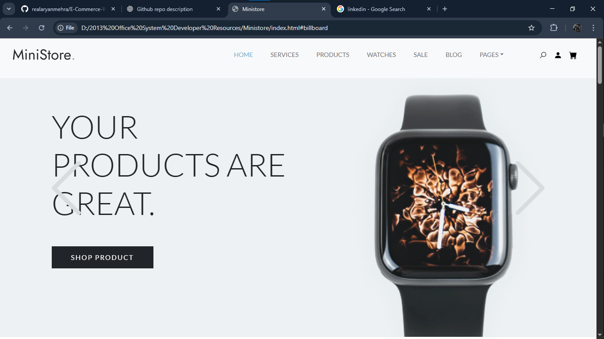
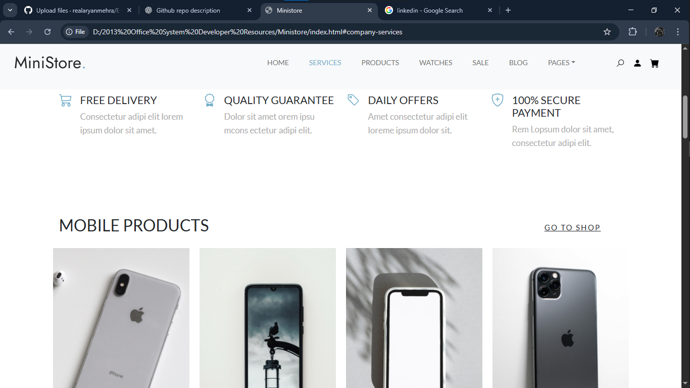
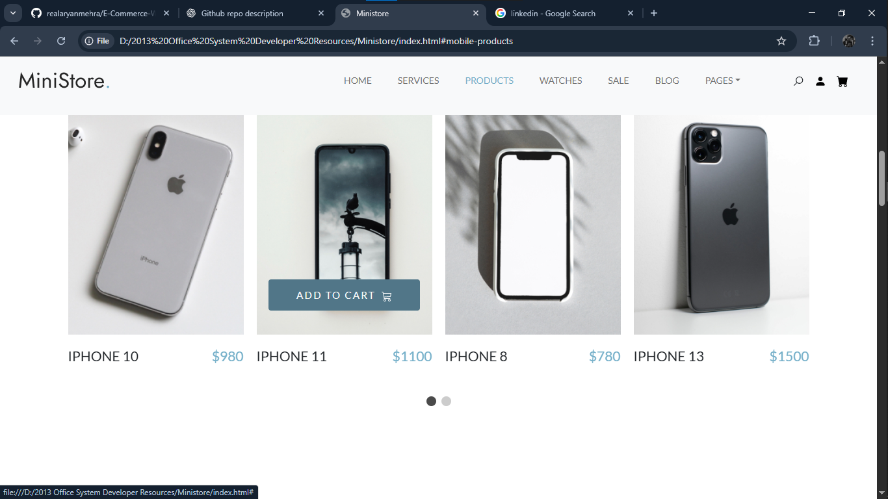
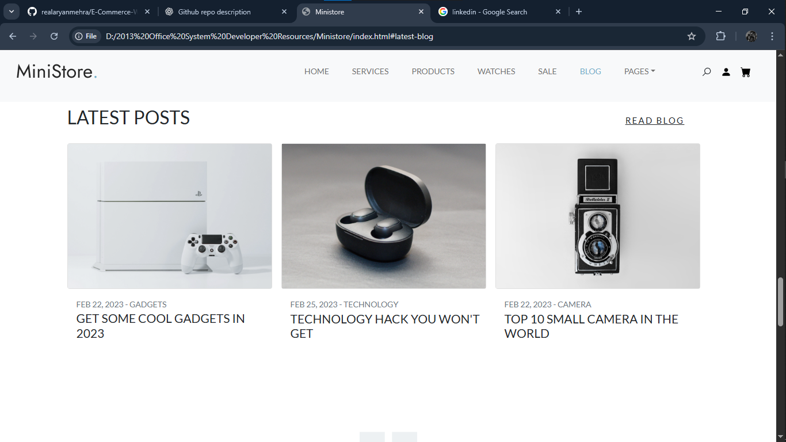

# E-Commerce-Website-made-Using-HTML-CSS-Javascript.
🛒 E-Commerce Website (MINISTORE)

A fully responsive E-Commerce Website built using HTML, CSS, and JavaScript, designed to provide a smooth and interactive online shopping experience.

✨ Features

Responsive Design – Works seamlessly on desktops, tablets, and mobile devices.

Product Listing – Display products with images, names, prices, and descriptions.

Search & Filter – Find products easily using keyword search or category filters.

Shopping Cart – Add, remove, and update items in a dynamic cart.

Checkout Page – Simple checkout form for placing orders.

Interactive UI – Smooth animations and hover effects using CSS & JavaScript.

🛠️ Technologies Used

HTML5 – For structure and content.

CSS3 – For styling and layout.

JavaScript (Vanilla JS) – For interactivity and dynamic features.

🚀 How to Run

Clone the repository

git clone https://github.com/realaryanmehra/E-Commerce-Website-made-Using-HTML-CSS-Javascript.git

Open index.html in your browser.

📸 Screenshots

📜 License

This project is licensed under the MIT License – you’re free to use, modify, and distribute it.
